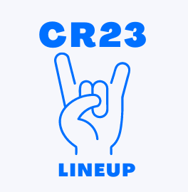
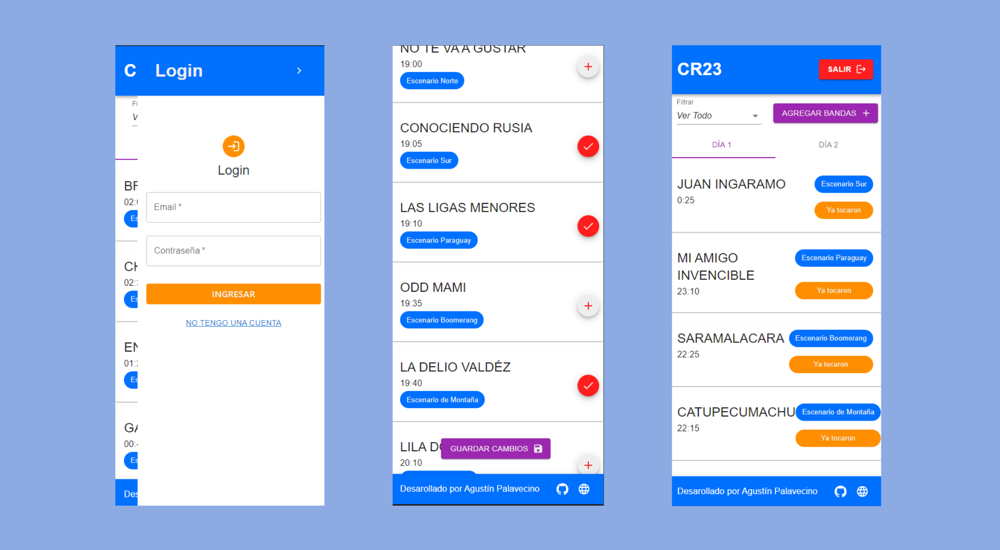

<h1 align="center">
   
  
   
  CR23
   
</h1>

<h4 align="center">CR23 es una aplicación web para cerar un lineUP personalizado del festival Cosquín Rock, permite crear una cuenta y 
guardar las bandas que se deseen ver para organizarse mejor.</h4>

## Funcionalidades
- `Registro`: Cualquier persona puede crear una cuenta para guardar el progreso de su LineUp
- `Login`: Autentificación del usuario con email y contraseña
- `Mi LineUp`: Permite visualizar las bandas guardadas (LineUp) vinculadas a la cuenta y tambíen si se visualiza el tiempo restante para cada show
- `Agregar bandas`: En el listado de todas las bandas del festival se puede agregar o eliminar una banda al LineUp 

## Deploy

- [Frontend](https://cr23.netlify.app/)
- [Backend](https://cr23-api.onrender.com)

## Tecnologías

- React
- Material UI
- Nodejs
- Express
- MongoDB
- Netlify
- Render

## API

[Repositorio](https://github.com/agupalavecino97/cr23_api)

---

> [Mi Portfolio](https://agustin-palavecino-portfolio.netlify.app/) &nbsp;&middot;&nbsp;
> GitHub [@agupalavecino97](https://github.com/agupalavecino97) &nbsp;&middot;&nbsp;
> LinkedIn [@agupalavecino97](https://www.linkedin.com/in/agustin-adrian-palavecino/) &nbsp;&middot;&nbsp;

